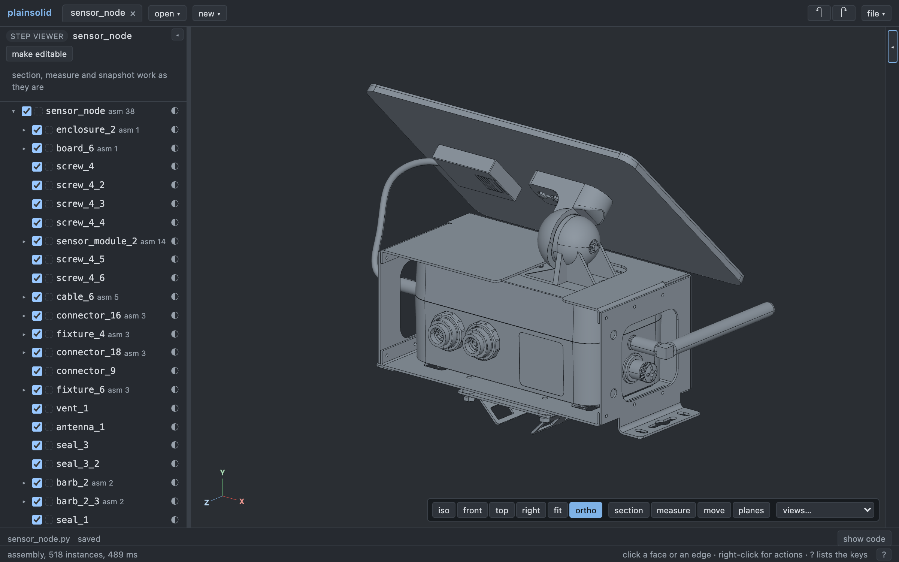
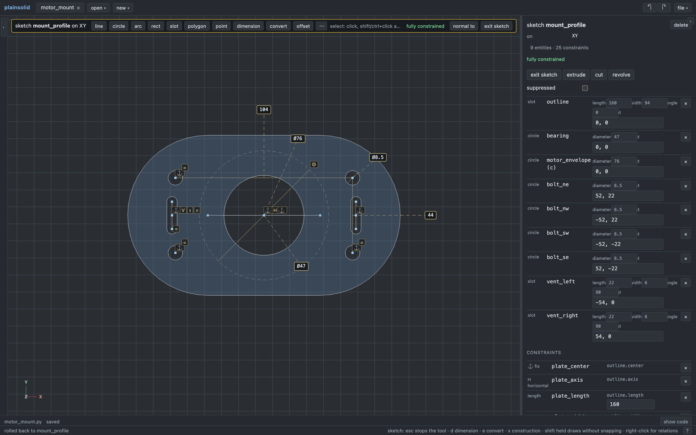
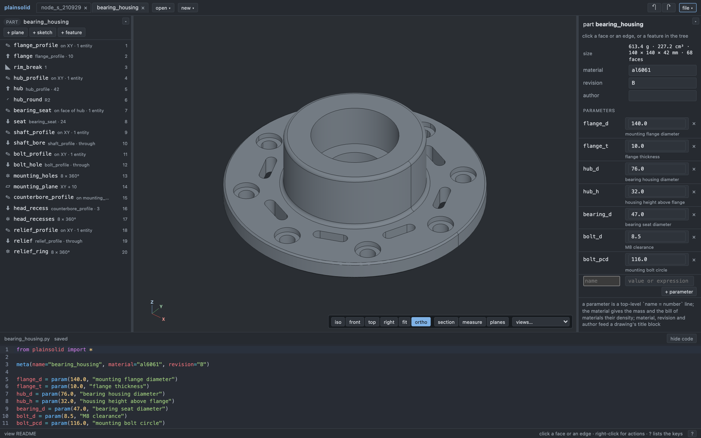

# plainsolid

A minimal parametric CAD tool in the spirit of SolidWorks, built as a
bidirectional GUI over a code model.

- The source of truth is a human-readable Python file. The GUI edits it in
  place; edits to the file update the 3D view. It diffs cleanly in git.
- Geometry is [build123d](https://github.com/gumyr/build123d) on OCCT.
- The engine is a local server with an API. The browser UI, the command line
  and the MCP server for agents are all clients of that engine.

It covers parts with constrained sketches and the usual features (extrude,
cut, revolve, fillet, chamfer, shell, patterns, mirror, reference planes),
assemblies of part files and vendor STEP files with mates and a pose solver,
drawings with views, sections, dimensions and notes, and the review of a
manufacturer's STEP proposal with sections, measurements and a compare
overlay against another file or the last commit.



A manufacturer's STEP assembly of a sensor node: 518 components with their original hierarchy, opened as a document like any other.



A fully constrained [motor-mount sketch](docs/examples/motor_mount.py), with
editable dimensions, equal holes and slots, and construction geometry.



A parametric bearing housing, from sketch to patterned features. Open the
[included model](docs/examples/bearing_housing.py) with
`uv run plainsolid serve docs/examples --open bearing_housing.py`.

## Getting started

```sh
brew install uv            # or see https://docs.astral.sh/uv/
uv sync                    # Python 3.13 environment with build123d and friends
uv run plainsolid serve    # the app on http://127.0.0.1:8321
```

Your documents live in `cad/` at the root of the checkout: gitignored, created
on the first run, and the only place the app reads and writes. Press "new" for
a part, or copy a STEP file into `cad/` and open it as a viewer. To look at the
examples instead, `uv run plainsolid serve zoo --open bracket.py`; any other
folder works the same way with `plainsolid serve DIR`. Keep in mind that `cad/`
is yours: git ignores it, and `git clean -x` would delete it.

The browser client is bundled into the Python package, so `plainsolid serve`
alone runs the whole app. To work on the client, see [web/README.md](web/README.md).
`uv tool install --editable .` puts `plainsolid` on your PATH, to run it from
any directory.

Everything the app does is also a command:

```sh
uv run plainsolid new cad/mount.py                  # a fresh part file, ready for a sketch
uv run plainsolid query zoo/node.py bom             # the assembly's bill of materials; also mass, interference
uv run plainsolid render zoo/bracket.py -o bracket.png --view iso
uv run plainsolid export zoo/node.py -o node.step   # the posed assembly with instance names and colours
uv run plainsolid edit zoo/bracket.py '{"op":"set_parameter","name":"thickness","value":5}' --dry-run
```

## A model file

```python
from plainsolid import *

meta(name="bracket", material="al6061", revision="A")

thickness = 4.0
hole_d = param(5.0, "clearance hole for M5")

profile = sketch("profile", on=XZ)
profile.line("bottom", (-30, 0), (30, 0))      # drawn loosely, pinned by constraints
profile.line("right", (30, 0), (30, 4))
profile.coincident("c1", "bottom.end", "right.start")
profile.horizontal("h1", "bottom")
profile.vertical("v1", "right")
profile.length("w", "bottom", 60)
profile.length("t", "right", thickness)
# ... four more lines close the L
body = extrude("body", profile, 40)

top = sketch("top", on=body.faces.where(normal="+Z").nearest((0, -20, 4)))   # a sketch on a face
lid = plane("lid", XY, offset=50)                                             # a reference plane

holes = sketch("holes", on=XY)
holes.project("back_edge", body.edges.where(parallel_to="+X").nearest((0, 0, 0)))
holes.circle("hole1", hole_d, at=(-10, -20))
holes.distance("y1", "hole1.center", "back_edge", 20)
cut("hole_cut", holes, through=True)

inner = fillet("inner", body.edges.from_sketch("inner_bottom").from_sketch("inner_wall"), 3)
outer = chamfer("outer", body.edges.from_sketch("bottom").from_sketch("outer_wall"), 2)
holes2 = linear_pattern("holes2", hole_cut, 2, spacing=20, direction=X)
```

Every feature, entity and constraint has a name. Faces and edges carry the
name of the sketch entity they came from and labels such as `top`, so
references read `body.faces.top` or `body.edges.top.from_sketch("bottom")`
instead of indices. The GUI writes those on a click whenever they are unique;
geometric selectors (`nearest`, `where`, `largest`) cover the rest.

Sketches take lines, arcs, circles, rectangles, slots and polygons,
constraints and dimensions, plus two derived entities: `project` converts
body edges, vertices or a face outline into geometry that follows the body,
and `offset` puts curves at a distance from other curves. Part features:
`extrude` (depth, `upto=` a face, `through=True`, draft, symmetric,
`op="cut"`), `cut`, `revolve`, `fillet`, `chamfer`, `shell`,
`linear_pattern`, `circular_pattern`, `mirror`, `plane`, `import_step`; every
feature accepts `suppressed=True`. The GUI edits these statements in place
with libcst, so comments and formatting survive, and after every sketch edit
the solved coordinates are written back into the numeric literals
(expressions are left alone).

## An assembly

```python
from plainsolid import *

meta(kind="assembly", name="node")

box = instance("box", "enclosure.py")
lid = instance("lid", "lid.py", color="#d8d8d0")
gland1 = instance("gland1", "vendor/gland_m12.step", material="nylon")

fixed("anchor", box)
coincident("lid_down", lid.faces.of("plate").bottom.largest(), box.faces.of("body").top)
coincident("lid_x", lid.planes.YZ, box.planes.YZ)
coincident("lid_y", lid.planes.XZ, box.planes.XZ)
concentric("gland1_axis", gland1.faces.where(kind="cylinder").largest(), box.faces.of("gland_cut").from_sketch("gland1"))
coincident("gland1_seat", gland1.faces.where(normal="-Z").nearest((0, 0, 0)), box.faces.of("body").from_sketch("box.top"))
```

An `instance` is a part file, evaluated in its own coordinates, or a vendor
STEP file taken as one rigid solid. Mates (`fixed`, `coincident`,
`concentric`, `distance`, `parallel`, `angle`) take references on the
instances in the part's own coordinates, plus the part's standard planes and
axes (`box.planes.XZ`, `gland1.axes.Z`). Two body faces mate face to face;
planes align; `flip=True` reverses. The solver moves each free instance as
little as it can, reports the degrees of freedom left and names redundant or
conflicting mates. After every edit the solved poses are written into the
instance statements (`at=`, `rotate=`), so the file always holds what is
shown. `query bom` lists one row per part file with count, material and mass;
`query interference` finds overlapping instances; `export` writes a STEP file
with the instance names and colours.

## A drawing

```python
from plainsolid import *

meta(kind="drawing", name="bracket_dwg", of="bracket.py", sheet="A4", revision="A")

front = view("front", direction=FRONT, at=(65, 140))
top = view("top", direction=TOP, at=(65, 62))
iso = view("iso", direction=ISO, at=(240, 140), scale=0.75, hidden=False)
section = view("section", section=YZ, offset=-10, at=(150, 66))

dimension("width", front.edges.of("body").bottom.from_sketch("outer_wall"), front.edges.of("body").bottom.from_sketch("right"), at=(0, -38))
dimension("hole", top.faces.of("hole_cut").from_sketch("hole1"), at=(-24, 16), text="2× Ø5")
dimension("fillet", front.faces.of("inner"), at=(-10, -8), kind="radius")
note("finish", "Break all edges 0.5 mm", at=(12, 28))
```

A drawing shows a part, an assembly or a STEP file on a sheet (A4, A3 or
letter, mm from the bottom-left corner). A `view` projects it with hidden
lines from a standard direction, or cuts it along a plane and hatches the
cut. Dimensions reference the model through the view they sit in, with the
same selectors as everywhere else. The title block takes the model's name,
material, revision and author. In the browser the sheet is an SVG: drag
views, dimensions and notes to place them, pick edges for a new dimension,
and export to PDF, DXF or SVG. From the command line: `plainsolid new
bracket_dwg.py --kind drawing --of bracket.py`, then `plainsolid export
bracket_dwg.py -o bracket.pdf`.

## Reviewing a STEP file from the contract manufacturer

```sh
uv run plainsolid tree proposals/node_v3.step          # writes node_v3.py next to it, prints the instance tree
uv run plainsolid render proposals/node_v3.py -o cut.png --plane XY --offset 12
uv run plainsolid measure proposals/node_v3.py face:12 face:40 --plane XY --offset 12
uv run plainsolid compare proposals/node_v3.py proposals/node_v2.py -o changes.png   # what v3 adds (green) and removes (red)
uv run plainsolid serve proposals --open node_v3.step  # section, measure, pin and snapshot in the browser
```

Opening a `.step` file creates a small wrapper model file next to it, so the
review is a text document like everything else. Instance names, hierarchy and
colours come through; view state (camera, section, pins, named views) lives
in a `<name>.views.json` sidecar. A STEP file holding one solid opens as a
part, ready to sketch on and cut. Right-click a sub-assembly in the tree,
before or after making the file editable, to open it in a tab of its own: it
gets a wrapper named after the node (`node_v3.glands.py`) and shows in its
own coordinates.

To modify a proposal, press "make editable" in the tree header: the import
turns into one instance per body, each pointing into the same STEP file
(`"node_v3.step#node.glands.gland_1"`) at the pose the file gave it. Select
a body and press "edit part": it gets a part file wrapping its node, every
instance of the same product follows, and the part opens in a tab. The STEP
file itself is never rewritten.

Real vendor and manufacturer files are not committed. Put them in `corpus/`
at the repository root, optionally with a `corpus/manifest.json`, and
`uv run pytest -m corpus` imports, sections and measures every one of them.

## Driving it from an agent

Every command prints JSON, every edit is a JSON operation, and geometry is
named by the same selectors the file uses:

```sh
uv run plainsolid docs                                   # the agent guide: the model file, selectors, edit operations, a worked session
uv run plainsolid edit parts/mount.py '{"op": "add_feature", "kind": "fillet", "name": "r1", "args": {"edges": {"expr": "body.edges.top"}, "radius": 2}}'
uv run plainsolid render parts/mount.py -o check.png --highlight body.edges.top --highlight r1   # what a selector picks, in orange
uv run plainsolid measure parts/mount.py body.faces.top body.faces.bottom
uv run plainsolid compare parts/mount.py --rev HEAD      # what the working copy adds to and removes from the last commit
uv run plainsolid mcp parts                              # the same as MCP tools on stdio
```

To give Claude Code the tools: `claude mcp add plainsolid -- uv run plainsolid mcp /path/to/project`.
The MCP server works in-process on the project directory, so a `plainsolid serve`
watching the same directory shows every edit the agent makes, and the agent
sees every edit made in the browser.

## Development

| Where | What |
|---|---|
| `src/plainsolid/` | the engine, the edit layer, the workspace and server, the CLI and MCP server, the agent guide |
| `web/` | the browser client; `npm run build` bundles it into the package |
| `zoo/` | reference documents that double as test fixtures |
| `tests/`, `scripts/` | the Python suites, `bench.py` and the performance baseline, the edit type generator |
| `docs/` | [design.md](docs/design.md) (decisions, architecture, API), [testing.md](docs/testing.md) |

```sh
uv run pytest                                   # everything but the local corpus
uv run pytest -m "unit or golden or roundtrip or solver"   # the fast layers
uv run ruff check src tests scripts
cd web && npm test && npm run build             # client state tests, type check, bundle
uv run python scripts/bench.py                  # timings and memory against tests/perf_baseline.json
```

CI runs the Python suite, the client tests and build, and the browser suite
in Chromium against a served copy of the zoo.

License: Apache 2.0, see [LICENSE](LICENSE).
